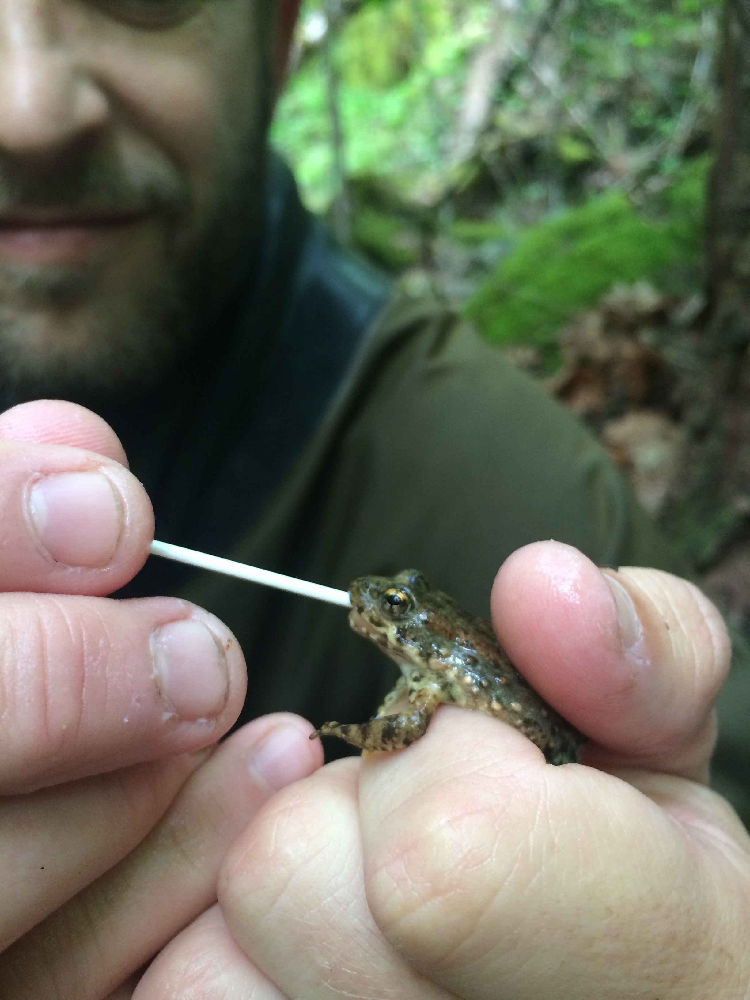

```{r setup, include=FALSE}
knitr::opts_chunk$set(echo = TRUE)
```

To collect DNA for high quality genomic sequencing and analysis of populations and landscape genetics, it is now possible to use a non-invasive and simple buccal swab method. The following materials and methods build on the same chytrid swab protocol delineated in [Briggs et al. 2009](http://online.sfsu.edu/vancev/Vredenburg_Lab/Protocols.html), which permits the same type of swab to be used.

## Materials

 - **Vials** Screw cap 1.5ml microcentrifuge tubes, available through Fisher (catalog number 02-707-352). Screw cap lids are best, the lids pop off if they don’t screw on. All microcentrifuge tubes used should be sterilized either by autoclaving before use or they can be purchased at a higher price as pre-sterilized (Fisher catalog number 05-669-17).
 - **Swabs** use [MW113](http://www.advantagebundlingsp.com/mwe_dryswab.pdf) (Peel Pouch Dryswab Fine Tip), which has a soft flexible plastic shaft and a rayon bud.

## Sampling

#### Animal Capture & Handling
Preferably, capture amphibians by hand. Separate gloves should be worn between each individual if collecting Bd skin swabs. If collecting buccal swabs, gloves are not mandatory, but hands should be sanitized and washed between each individual.

#### Buccal Swabbing
Gently open the frog's mouth (sometimes this may requires gently leveraging the small notch at the most distal point of the jaw) and comprehensively swab each specimen underneath its tongue and cheek for about a minute.  I typically swab the inside of one side of the lower mouth and then the other side (count to 20 on each side), in addition to swabbing the tongue in the lower mouth (count to 20). Avoid swabbing the upper mouth because ranid frogs have eye sockets that descend into the buccal cavity, and there is more potential to injure the individual. I find rolling the swab between your fingers while swabbing seems to be an efficient way to take the sample. Air dry the swab for approximately 5 minutes, avoid direct sunlight if possible.

#### Storing Swabs

Gently break off the plastic handle so the swab will fit into the tube, and seal the tube (if conditions are too humid to air dry add 1 drop of 95% EtOH to each vial; this sterilizes the sample and keeps unwanted microbes from decomposing the sample). Samples can be stored at room temperature for a few days, but should be placed in a freezer as soon as possible. Long-term storage should be done at -20°C or -80°C until DNA extraction.

## Literature

Method adapted from/supported by the following papers:

Beebee, T. J. C. 2008. Buccal swabbing as a source of DNA from squamate reptiles. Conservation genetics 9:1087–1088.

Broquet, T., L. Berset-Braendli, G. Emaresi, and L. Fumagalli. 2007. Buccal swabs allow efficient and reliable microsatellite genotyping in amphibians. Conservation genetics 8:509–511.

Goldberg, C. S., M. E. Kaplan, and C. R. Schwalbe. 2003. From the frog’s mouth: buccal swabs for collection of DNA from amphibians. Herpetological review.

Pidancier, N., C. Miquel, and C. Miaud. 2003. Buccal swabs as a non-destructive tissue sampling method for DNA analysis in amphibians. The Herpetological journal 13:175–178.


## Swabbing Photos




